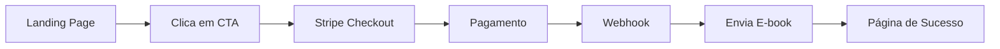

# 📖 Manual da Fertilidade - Landing Page & E-commerce

> Landing page moderna e responsiva para venda de e-book sobre fertilidade, com integração completa de pagamento via Stripe e automação de entrega por e-mail.


## 🚀 Visão Geral

Aplicação full-stack moderna para venda de e-book digital com foco em conversão de vendas. Implementa as melhores práticas de marketing digital com:

- ✅ Landing page otimizada para conversão
- ✅ Integração de pagamento com Stripe
- ✅ Automação de entrega de produto por e-mail
- ✅ Webhooks para processamento seguro de pagamentos
- ✅ Design responsivo e mobile-first
- ✅ Edge Functions com Supabase para backend serverless

## 📋 Funcionalidades

### 🎨 Frontend (Landing Page)

- **Hero Section** com headlines rotativas e CTAs estratégicos
- **Problema e Conscientização** - Destaca dores e necessidades do público-alvo
- **Prova Social** - Depoimentos e credibilidade
- **Formulário de Lead** - Captura e-mail para remarketing
- **Oferta de Upgrade** - Upsell estratégico
- **FAQ** - Responde objeções comuns
- **Design Responsivo** - Otimizado para todos os dispositivos

### 💳 Processamento de Pagamentos

- **Stripe Checkout** - Experiência segura e otimizada
- **Webhook Handler** - Processamento assíncrono de eventos
- **Suporte a múltiplos métodos** de pagamento
- **Retry automático** de webhooks em caso de falha

### 📧 Automação de Entrega

- **Envio automático de e-book** após confirmação de pagamento
- **E-mail transacional** com branding personalizado
- **Link de download seguro** para o produto digital

## 🛠️ Tecnologias

### Frontend
- **React 18.3** - Biblioteca UI moderna
- **TypeScript** - Type safety e melhor DX
- **Vite** - Build tool ultrarrápida
- **Tailwind CSS** - Utility-first CSS framework
- **Lucide React** - Ícones modernos e otimizados

### Backend (Edge Functions)
- **Supabase Edge Functions** - Backend serverless
- **Deno Runtime** - Runtime moderno para TypeScript
- **Stripe API** - Processamento de pagamentos

### Ferramentas de Desenvolvimento
- **ESLint** - Linting e qualidade de código
- **PostCSS** - Processamento de CSS
- **Autoprefixer** - Compatibilidade cross-browser

## 📦 Instalação

### Pré-requisitos

- Node.js 18+ 
- npm ou yarn
- Conta Stripe (modo de teste ou produção)
- Conta Supabase

### Passo a Passo

1. **Clone o repositório**
```bash
git clone <repository-url>
cd project
```

2. **Instale as dependências**
```bash
npm install
```

3. **Configure as variáveis de ambiente**

Crie um arquivo `.env.local` na raiz do projeto:

```env
VITE_STRIPE_PUBLIC_KEY=pk_test_your_stripe_public_key
VITE_SUPABASE_URL=https://your-project.supabase.co
VITE_SUPABASE_ANON_KEY=your_supabase_anon_key
```

4. **Configure o Stripe**

Atualize o arquivo `src/stripe-config.ts` com seu Price ID:

```typescript
export const stripeProducts = {
  'manual-fertilidade': {
    priceId: 'price_YOUR_ACTUAL_STRIPE_PRICE_ID',
    // ...
  }
}
```

5. **Inicie o servidor de desenvolvimento**
```bash
npm run dev
```

A aplicação estará disponível em `http://localhost:5173`

## 🔧 Configuração do Backend

### Supabase Edge Functions

1. **Instale o Supabase CLI**
```bash
npm install -g supabase
```

2. **Faça login no Supabase**
```bash
supabase login
```

3. **Link com seu projeto**
```bash
supabase link --project-ref your-project-ref
```

4. **Configure os secrets**
```bash
supabase secrets set STRIPE_SECRET_KEY=sk_test_your_stripe_secret_key
supabase secrets set SUPABASE_SERVICE_ROLE_KEY=your_service_role_key
```

5. **Deploy das Edge Functions**
```bash
supabase functions deploy stripe-checkout
supabase functions deploy stripe-webhook
supabase functions deploy send-ebook
```

### Configuração do Webhook do Stripe

1. Acesse o Dashboard do Stripe
2. Vá em **Developers** > **Webhooks**
3. Adicione endpoint: `https://your-project.supabase.co/functions/v1/stripe-webhook`
4. Selecione os eventos:
   - `checkout.session.completed`
   - `payment_intent.succeeded`
   - `payment_intent.payment_failed`

## 📜 Scripts Disponíveis

```bash
npm run dev      # Inicia servidor de desenvolvimento
npm run build    # Cria build de produção
npm run preview  # Preview do build de produção
npm run lint     # Executa ESLint
```

## 🏗️ Estrutura do Projeto

```
project/
├── src/
│   ├── components/        # Componentes React
│   │   ├── Header.tsx
│   │   ├── Hero.tsx
│   │   ├── LeadForm.tsx
│   │   └── ...
│   ├── pages/            # Páginas da aplicação
│   │   └── Success.tsx
│   ├── stripe-config.ts  # Configuração Stripe
│   ├── App.tsx           # Componente principal
│   └── main.tsx          # Entry point
├── supabase/
│   ├── functions/        # Edge Functions
│   │   ├── stripe-checkout/
│   │   ├── stripe-webhook/
│   │   └── send-ebook/
│   └── migrations/       # Database migrations
├── package.json
├── vite.config.ts
├── tailwind.config.js
└── tsconfig.json
```

## 🎯 Fluxo de Compra



1. Usuário navega pela landing page
2. Clica no botão de compra (CTA)
3. É redirecionado para Stripe Checkout
4. Realiza o pagamento
5. Stripe envia webhook para Supabase
6. Edge Function processa e envia e-book por e-mail
7. Usuário é redirecionado para página de sucesso

## 🎨 Personalização

### Alterar Cores do Tema

Edite `tailwind.config.js`:

```javascript
module.exports = {
  theme: {
    extend: {
      colors: {
        primary: '#10b981',   // Verde principal
        secondary: '#14b8a6', // Teal
      }
    }
  }
}
```

### Modificar Conteúdo

Os textos e conteúdos estão nos componentes em `src/components/`. Cada seção é um componente independente para fácil manutenção.

### Adicionar Produtos

Adicione novos produtos em `src/stripe-config.ts`:

```typescript
export const stripeProducts = {
  'manual-fertilidade': { /* ... */ },
  'novo-produto': {
    priceId: 'price_xxx',
    name: 'Novo Produto',
    description: 'Descrição',
    price: 49.90,
    currency: 'BRL',
    mode: 'payment'
  }
}
```

## 🚀 Deploy

### Frontend (Vercel/Netlify)

1. **Build do projeto**
```bash
npm run build
```

2. **Deploy**
- Vercel: `vercel --prod`
- Netlify: `netlify deploy --prod`

### Backend (Supabase)

```bash
supabase functions deploy --no-verify-jwt
```

## 📊 Performance

- ⚡ **Lighthouse Score**: 95+ (Performance)
- 📱 **Mobile-First**: Design otimizado para mobile
- 🎨 **CSS Otimizado**: Tailwind com purge automático
- 🚀 **Bundle Size**: < 200KB (gzipped)

## 🔒 Segurança

- ✅ Validação de webhooks com Stripe signatures
- ✅ CORS configurado adequadamente
- ✅ Variáveis sensíveis em environment variables
- ✅ Edge Functions com autenticação
- ✅ Rate limiting nos endpoints

## 🤝 Contribuindo

Contribuições são bem-vindas! Por favor:

1. Fork o projeto
2. Crie uma branch para sua feature (`git checkout -b feature/MinhaFeature`)
3. Commit suas mudanças (`git commit -m 'Adiciona MinhaFeature'`)
4. Push para a branch (`git push origin feature/MinhaFeature`)
5. Abra um Pull Request

## 📝 Licença

Este projeto é privado e proprietário. Todos os direitos reservados.

## 👨‍💻 Autor

**Dario Jr**

---

## 🆘 Suporte

Para questões e suporte:
- 📧 Email: contato@example.com
- 💬 Issues: Use a aba "Issues" do GitHub

---

<div align="center">
  
**Desenvolvido com ❤️ usando React + TypeScript + Supabase**

</div>
